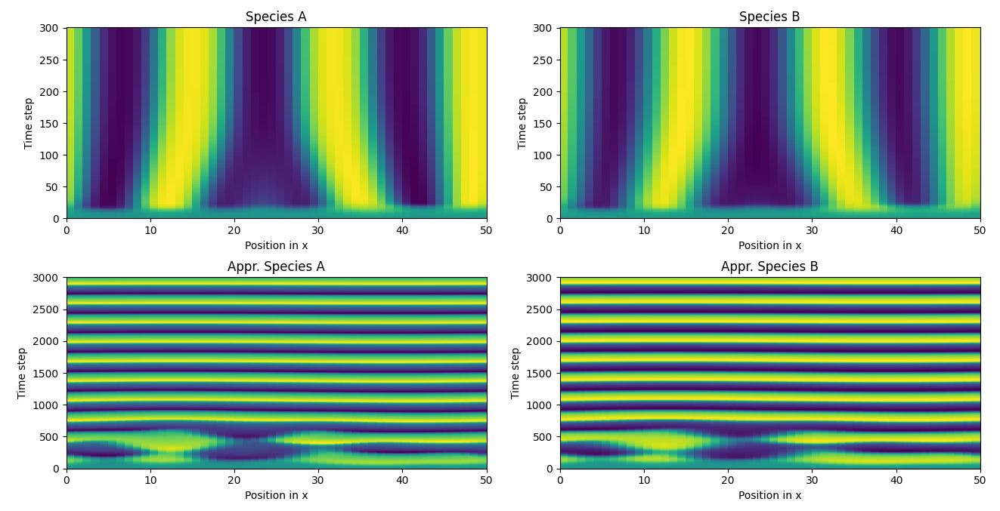

# Estimating a Reaction-Diffusion System
Whilst the dynamics in systems can be defined neatly using differential
equations, the approximation of their parameters becomes quickly
intractable when dealing with PDEs. Reaction-Diffusion systems offer a potent
toolset to analyse a set of non-linear PDEs. Here, we make use of a modified
version of an expected maximisation (EM) algorithm using BSplines, which 
was proposed by Brewer et al. 2008 [1], to derive the parameters of a 
reaction-diffusion system from data points. For an interactive and explanatory
guide for how to use the fitting method, see the interactive [Jupyter Notebook](ODE%20Parameter%20Estimation%20Jupyter%20Example.ipynb).
You can run it locally with the command
```commandline
python3 -m jupyter notebook
```

## Requirements
Please install the following software 
- Python3
- pip3
- singularity (if you want to run the model in a virtual environment)

## Installation of Python libraries
To install the necessary python requirements simply run
```bash
python3 -m pip install -r requirements.txt
```

## Run the Simple Test Example
Run 
```bash
python3 test_main.py
```
which shows the example of a predefined reaction diffusion system of the form


It will load the dummy data from the data directory
and try to derive the correct parameters for the ODE.
Note that the algorithm is heavily dependent on
the degree that is used for the BSplines to approximate
the time course. While a degree of `k=5` or `k=4` should produce
an outcome like


setting the degree of the BSplines to `k=3` has a large
influence on the derived parameters and hence on the
system dynamics

 

## Run the General Example
To run the same example, but implemented with ODEs that were only defined in the main (instead of being given)
run
```bash
python3 general_main.py
```
Use this as a reference if you want to estimate the parameters of an ODE with a customised layout.


## References
[1] Brewer, Daniel, et al. "Fitting ordinary differential equations to short time course data." Philosophical Transactions of the Royal Society A: Mathematical, Physical and Engineering Sciences 366.1865 (2008): 519-544.