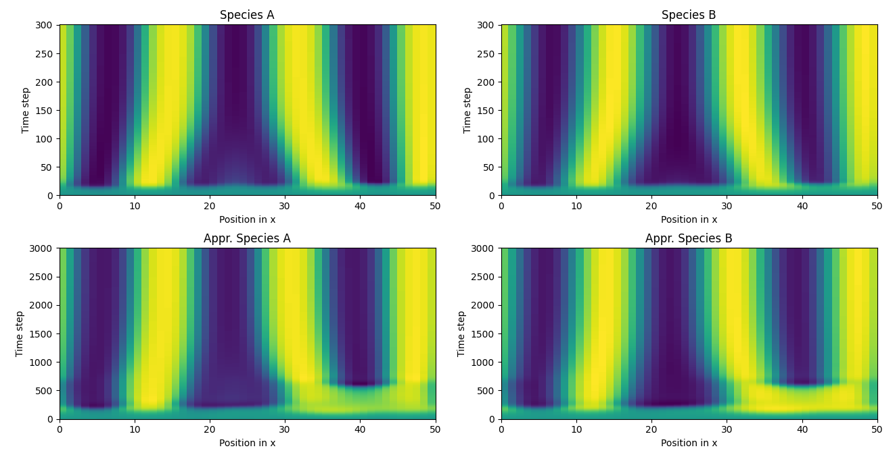

# Modelling of the TC-NER Pathway Through Parameter Fitting of ODEs
This approach aims to fit the parameters of a 
predefined set of ODEs, which are derived from 
reaction-diffusion systems to be able to model 
change in space and time without the need to rely 
on PDEs. A more detailed description is soon to come.

## Requirements
Please install the following software 
- Python3
- pip3
- singularity (if you want to run the model in a virtual environment)

## Installation of Python libraries
To install the necessary python requirements simply run
```bash
python3 -m pip install -r requirements.txt
```

## Run the test case
Run 
```bash
python3 test_main.py
```

It will load the dummy data from the data directory
and try to derive the correct parameters for the ODE.
Note that the algorithm is heavily dependent on
the degree that is used for the BSplines to approximate
the time course. While a degree of `k=5` or `k=4` should produce
an outcome like



setting the degree of the BSplines to `k=3` has a large
influence on the derived parameters and hence on the
system dynamics

 